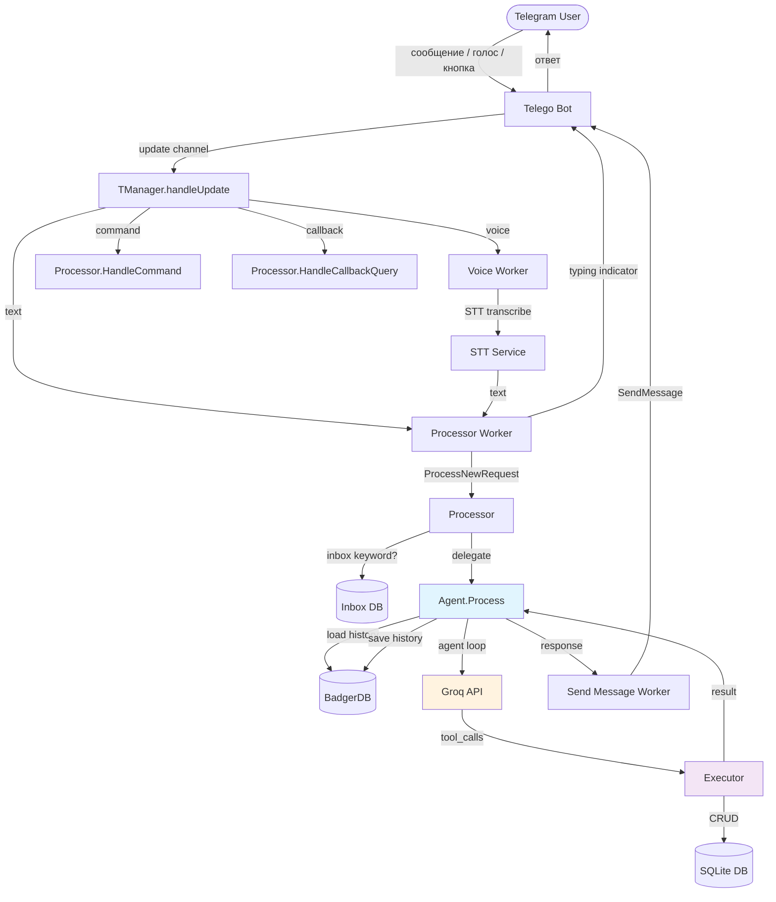
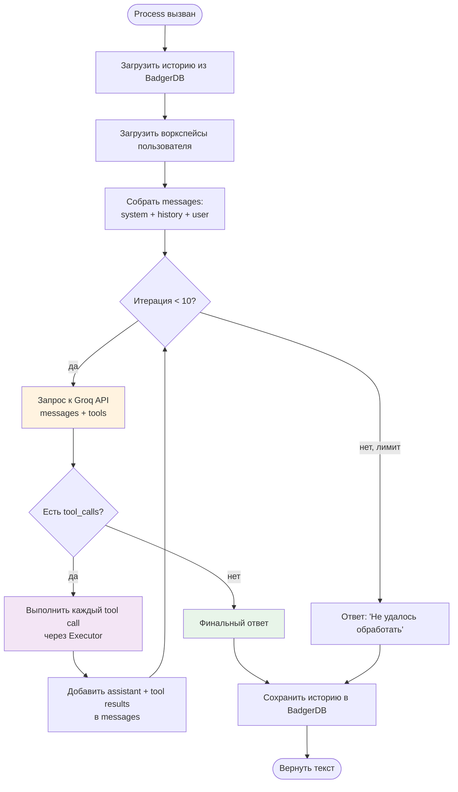
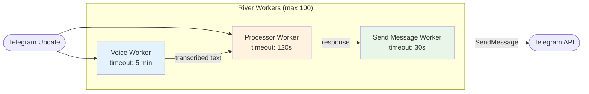
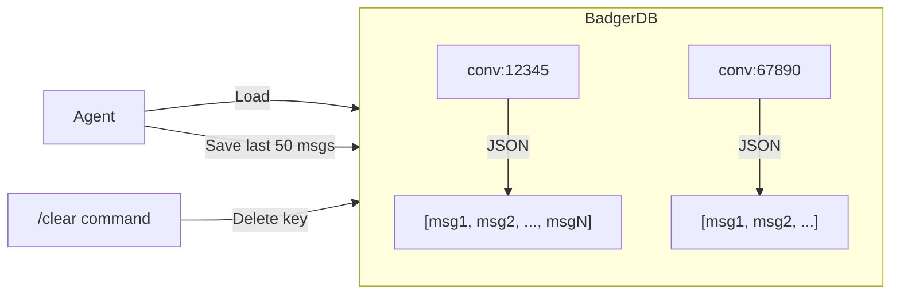
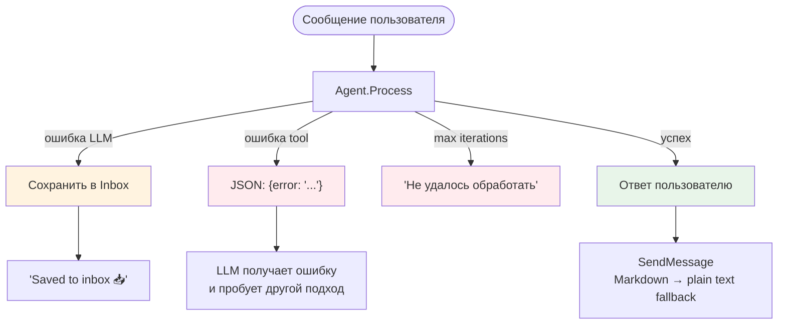

# AI Agent Architecture

## Обзор

DoneJournal Agent — AI-ассистент для управления задачами и заметками через Telegram-бота. Использует паттерн **Tool-Use / Function Calling** с поддержкой многоитерационного цикла, историей диалога и асинхронной обработкой через очередь задач.

**Ключевые технологии:**

- **LLM Provider**: Groq API (OpenAI-совместимый формат)
- **Conversation Memory**: BadgerDB (key-value store)
- **Job Queue**: River (SQLite-backed)
- **Telegram Bot**: Telego

---

## Архитектура

### Общая схема обработки сообщения



### Agent Loop (цикл tool-use)



### Очередь задач (River)



---

## Структура файлов

```text
internal/agent/
├── agent.go           # Agent struct, Process(), system prompt, ClearConversation()
├── conversation.go    # ConversationStore (BadgerDB), Load/Save/Clear
├── executor.go        # Executor — диспетчер tool calls → сервисы
├── tools.go           # Определения всех tools (JSON Schema)
└── provider/
    ├── types.go       # Provider interface, ChatMessage, ToolCall, ToolDefinition
    └── groq/
        └── groq.go    # Groq API client (OpenAI-compatible)
```

---

## Tools (инструменты агента)

| Tool              | Описание                         | Ключевые параметры                                     |
| ----------------- | -------------------------------- | ------------------------------------------------------ |
| `create_todo`     | Создать задачу                   | `title`\*, `status`, `planned_date`, `workspace`       |
| `create_note`     | Создать заметку                  | `title`\*, `body`, `workspace`                         |
| `find_todos`      | Найти задачи по фильтрам         | `status[]`, `date_from`, `date_to`, `workspace`        |
| `find_notes`      | Найти заметки                    | `search`, `workspace`                                  |
| `complete_todo`   | Отметить задачу выполненной      | `id`\*                                                 |
| `update_todo`     | Изменить задачу                  | `id`\*, `title`, `status`, `planned_date`, `workspace` |
| `delete_todo`     | Удалить задачу                   | `id`\*                                                 |
| `update_note`     | Изменить заметку                 | `id`\*, `title`, `body`, `workspace`                   |
| `delete_note`     | Удалить заметку                  | `id`\*                                                 |
| `list_workspaces` | Список воркспейсов               | —                                                      |
| `save_to_inbox`   | Сохранить в inbox                | `text`\*                                               |
| `get_todo_stats`  | Статистика по задачам            | `date_from`, `date_to`, `workspace`                    |
| `list_inbox`      | Список inbox items               | —                                                      |
| `convert_inbox`   | Конвертировать inbox → todo/note | `inbox_id`_, `convert_to`_                             |

\* — обязательный параметр

---

## Как добавить новый tool

### Шаг 1: Определение tool в `tools.go`

Добавить `provider.ToolDefinition` в функцию `toolDefinitions()`:

```go
{
    Name:        "my_new_tool",
    Description: "Описание для LLM — что делает этот инструмент и когда его использовать",
    Parameters: map[string]any{
        "type": "object",
        "properties": map[string]any{
            "param1": map[string]any{
                "type":        "string",
                "description": "Описание параметра",
            },
            "param2": map[string]any{
                "type":        "integer",
                "description": "Описание параметра",
            },
        },
        "required": []string{"param1"},
    },
},
```

**Рекомендации:**

- `Description` — пишите подробно, LLM использует его для выбора инструмента
- `required` — указывайте обязательные параметры
- Типы: `string`, `integer`, `boolean`, `array`, `object`
- Для enum: `"enum": []string{"value1", "value2"}`

### Шаг 2: Реализация в `executor.go`

1. Добавить case в `Execute()`:

```go
case "my_new_tool":
    return e.myNewTool(ctx, userID, args)
```

2. Создать метод:

```go
func (e *Executor) myNewTool(ctx context.Context, userID int64, args map[string]any) (string, error) {
    // 1. Извлечь параметры
    param1, _ := args["param1"].(string)
    if param1 == "" {
        return "", fmt.Errorf("param1 is required")
    }

    // 2. Вызвать сервис
    result, err := e.services.MyService().DoSomething(ctx, param1)
    if err != nil {
        return "", fmt.Errorf("failed to do something: %w", err)
    }

    // 3. Вернуть JSON
    response := map[string]any{
        "id":     result.ID,
        "status": "ok",
    }
    data, _ := json.Marshal(response)
    return string(data), nil
}
```

### Шаг 3: Обновить system prompt (при необходимости)

Если tool требует специального поведения, добавить правило в `buildSystemPrompt()` в `agent.go`:

```go
- "keyword"/"ключевое слово" → my_new_tool
```

### Шаг 4: Проверить

```bash
go build ./...
```

Отправить сообщение боту, которое должно триггерить новый tool. Проверить логи:

```text
agent tool calls  iteration=1  tool_count=1
```

---

## Conversation Memory

### Как работает



- **Ключ**: `conv:{userID}` (например, `conv:46472`)
- **Значение**: JSON-массив `ChatMessage` (role, content, tool_calls, tool_call_id)
- **Лимит**: последние 50 сообщений
- **System prompt** не сохраняется — генерируется при каждом запросе

### Структура сообщения

```go
type ChatMessage struct {
    Role       string     // "user", "assistant", "tool"
    Content    string     // Текст сообщения
    ToolCalls  []ToolCall // Вызовы инструментов (только для assistant)
    ToolCallID string     // ID вызова (только для tool results)
}
```

---

## Provider (LLM интеграция)

### Интерфейс

```go
type Provider interface {
    ChatCompletion(ctx context.Context, req ChatRequest) (*ChatResponse, error)
}
```

### Как добавить нового провайдера

1. Создать пакет `internal/agent/provider/newprovider/`
2. Реализовать `provider.Provider` интерфейс
3. Подключить в `cmd/donejournal/start.go`

### Текущий провайдер: Groq

| Параметр     | Значение                                          |
| ------------ | ------------------------------------------------- |
| API URL      | `https://api.groq.com/openai/v1/chat/completions` |
| Формат       | OpenAI-compatible                                 |
| Temperature  | 0.1                                               |
| Max Tokens   | 4096                                              |
| HTTP Timeout | 120s                                              |

---

## Обработка ошибок



- **LLM недоступен**: сообщение сохраняется в Inbox как fallback
- **Tool execution error**: ошибка передаётся LLM в формате JSON, он может попробовать снова
- **Max iterations**: возвращается сообщение об ошибке
- **Telegram parse error**: автоматический fallback с Markdown на plain text

---

## Константы и лимиты

| Константа                   | Значение   | Где                      |
| --------------------------- | ---------- | ------------------------ |
| `maxToolIterations`         | 10         | `agent.go`               |
| `maxConversationMessages`   | 50         | `conversation.go`        |
| `processorWorker.Timeout`   | 120s       | `worker_processor.go`    |
| `voiceWorker.Timeout`       | 5 min      | `worker_voice.go`        |
| `sendMessageWorker.Timeout` | 30s        | `worker_send_message.go` |
| `River MaxWorkers`          | 100        | `tmanager.go`            |
| `Groq Temperature`          | 0.1        | `groq.go`                |
| `Groq MaxTokens`            | 4096       | `groq.go`                |
| `Bot updates channel`       | 500 buffer | `bot.go`                 |

---

## Telegram Bot команды

| Команда           | Действие                       |
| ----------------- | ------------------------------ |
| `/start`, `/menu` | Главное меню с inline-кнопками |
| `/clear`          | Очистить историю диалога       |
| Текст             | Обработка через Agent          |
| Голосовое         | STT → Agent                    |

### Inline-кнопки (callback queries)

```text
Главное меню
├── 📝 Показать TODO
│   ├── Сегодня
│   ├── Завтра
│   └── « Назад
└── ✅ Показать выполненное
    ├── Сегодня
    ├── Вчера
    ├── Позавчера
    └── « Назад
```
